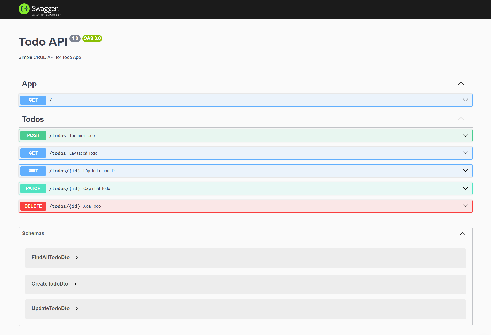

<p align="center">
  <a href="https://nestjs.com/" target="_blank"></a>
</p>

<h2 align="center">Todo API - NestJS</h2>
<p align="center">
  📝 A simple yet scalable RESTful Todo API built with <a href="https://nestjs.com/">NestJS</a>, featuring Swagger, validation, and a clean architecture.
</p>

<p align="center">
  
  
  
</p>

---

## 🚀 Features

- ✅ RESTful API with CRUD operations
- ✅ Swagger API Documentation
- ✅ DTO Validation with `class-validator`
- ✅ Exception Handling
- ✅ Database-ready setup
- ✅ Scalable architecture (Modularized)

---

## 📸 API Preview

> Swagger UI:

<p align="center">
  
</p>

---

## 📦 Tech Stack

- **Framework:** [NestJS](https://nestjs.com)
- **Language:** TypeScript
- **Docs:** Swagger (`@nestjs/swagger`)
- **Validation:** `class-validator`, `class-transformer`

## Project setup

```bash
$ npm install
```

## Compile and run the project

```bash
# development
$ npm run start

# watch mode
$ npm run start:dev

# production mode
$ npm run start:prod
```

## Run tests

```bash
# unit tests
$ npm run test

# e2e tests
$ npm run test:e2e

# test coverage
$ npm run test:cov
```

## Author

- Hoàng Ngọc Trí – linkedin.com/in/trí-hoàng-22929a359

## License

Nest is [MIT licensed](https://github.com/nestjs/nest/blob/master/LICENSE).
